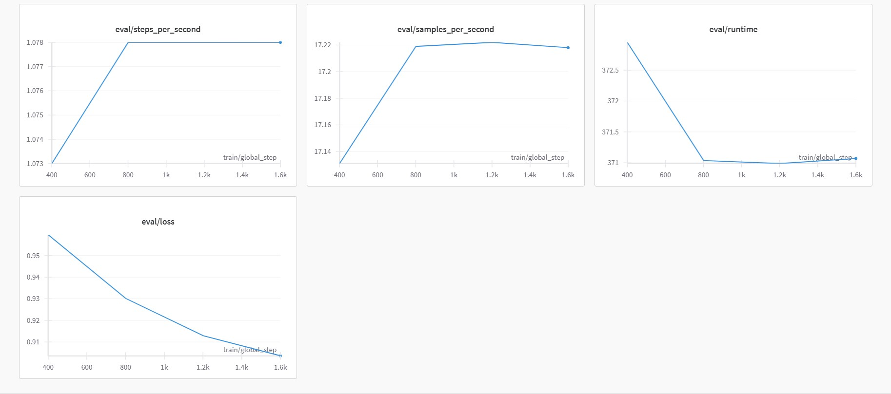
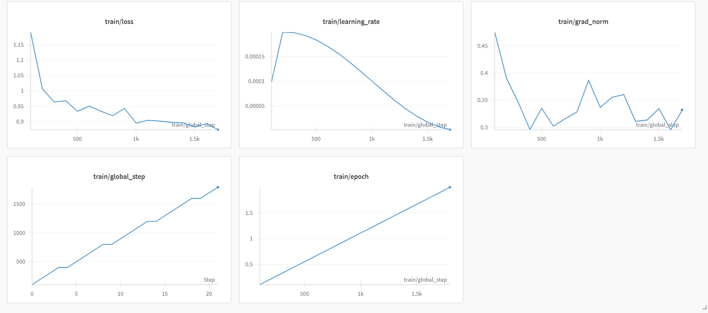

# Fine-tuning a large language model using QLoRA

---

Fine-tuning Mistral 24B Instruct with custom dataset. The dataset contains 56B tokens.

## Table of Contents
- [Training](#training)
  - [Quantization](#quantization)
  - [Low-rank adaptation](#low-rank-adaptation)
  - [Training process](#training-process)
- [File Structure](#file-structure)
- [Dataset](#dataset)
- [Libraries](#libraries)

## Training

It was adapted using CLM (Causal Language Modeling) method.

### Quantization

The model was quantized from 16-bits to 4-bits using BitsAndBytesConfig. 

Also it's important to load a model with the same quantization for inferencing.

### Low-rank adaptation

LoRA configuration:
 - `r = 32`
 - `lora alpha = 64`
 - `lora dropout = 0.05`
 - `target modules are: q_proj, k_proj, v_proj`
 - `all the biases were used for adapting` 
 
where r is adapters matricies rank, lora alpha is a scaling factor.

Only `q_proj`, `k_proj`, `v_proj` (query projection, key projection and value projection) layers were adapted.

### Training process

Training arguments:
 - `batch size per GPU = 8`
 - `gradient accumulation steps = 4`
 - `evaluation steps = 400`
 - `saving steps = 400`
 - `epochs = 2`

Optimizer:
 - `learning rate = 2e-4`
 - `optimizer is paged_adamw_8bit`
 - `warmup steps = 200`
 - `learning scheduler type is cosine`

### Results

The `dashboards` directory contains both the training and evaluation dashboards.

## File Structure
 - `train.ipynb`: Training proccess jupyter notebook
 - `inference.ipynb`: Testing the fine-tuned model

## Dataset

The data was collected with python parsing using BeautifulSoup4. Only websites which allows to use their data was parsed. Also the training sample contains free distributed datasets about food and health.

The dataset was split into 2 subsets: 90% for training and 10% for evaluation.

Dataset structure:
 - `recipes (43%)`
 - `product compositions (25%)`
 - `articles (18%)`
 - `code (10%)`
 - `product descriptions (3%)`
 - `chemical additions (1%)`

## Libraries
- `transformers 4.51.3`
- `torch 2.7.0`
- `peft 0.15.2`
- `wandb 0.19.10`
- `bitsandbytes 0.45.5`
- `tf_keras 2.19.0`
- `datasets 3.5.1`
- `accelerate 1.6.0`
- `dotenv 1.1.0`